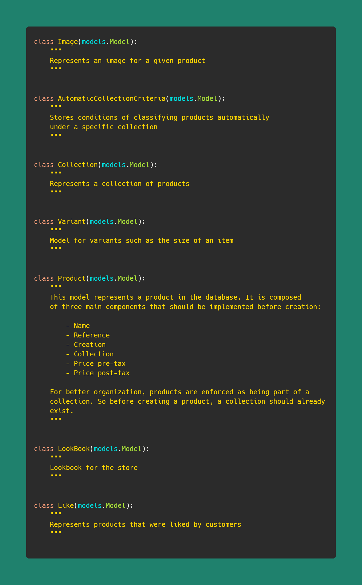

# Django Ecommerce Website

This template is an __ecommerce website intended for a single business owner that wants to sell products online on his own store.__

If you are interested in a marketplace __where different users can login in a similar way to Shopify, create different stores in which they can create different set of products and start selling directly to customers__ checkout [this template instead](https://github.com/Zadigo/ecommerce_marketplace_template).

# About

This project came to mind as ecommerce is extremely popular nowadays becomes of various unfortunate circumstances.

While there are many many web applications out there to build an ecommerce plateform, it can come at a certain financial cost.

Additionally, you do not have complete control over your SEO or tools you wish to implement because of how much they would cost especially for startup projects.

Creating an ecommerce website from scratch can be a complete hassle. This is where it came about creating these free templates using various free open-source tools around the internet.

While Django is the best web framework ever and Python the greatest language to ever exist, it does not come with things typical for ecommerce websites.

So by creating these free to use templates, you can have your ecommerce plateform without the hassle of coding the majority of the thing and you will be ready to go very fast.


[](https://www.youtube.com/watch?v=SpeDK1TPbew)


# Dependencies

The template depends on the following librairies:

    - Celery
    - Celery Beat
    - Social Django
    - Psycopg2
    - Stripe
    - Django Extensions
    - Django Rest Framework
    - Boto 3
    - Pandas + Numpy
    - Flower
    - Django Storages
    - Python Memcache

And for production:

    - Gunicorn
    - Redis

Additional librairies include:

    - Zappa

This template uses MD Bootrap's [Ecommerce template](https://mdbootstrap.com/freebies/jquery/e-commerce/) and [Dashboard](https://mdbootstrap.com/freebies/jquery/admin-dashboard/) it's main design interface. If you want to implement new items from these original templates, feel free to visit the former links.

By extension, the design CSS framework used for this website is [Bootstrap](https://getbootstrap.com/).

Finally, this was created with the lastest version of Django (3.0.x) and Python (3.8.x) and has never been tested with previous versions. There is therefore no guaranty that you application will work as intended if you decide to use versions prior to these ones.

## Front end

The whole website's frontend is based around using [Vue JS](https://vuejs.org/). Vue is by the definition the best thing to have ever happened to frontend web development because it simplifies to no extent the implementation of reactivity on you modern web pages.

Vue JS works very very well with Django's templates in the sense that they [the Django template syntax and Vue Js' template syntax] can be binded with one another without any problem.

Vue JS is very easy to pick up and if you wish improve the scripts on the various pages, have no experience with Vue, please visit the link above.

# Organization

The template uses three main applications: `shop`, `cart`, `accounts` and `dashboard`.

The optional other applications are:

    - Analytics
    - Discounts
    - Legal
    - Hero
    - Nodes Plus
    - Store
    - Subscribers
    - Customer care
    - Store

## Templates folder

Each template folder is organized in this specific manner:

* Pages - They represent the main HTML page for the customer
* Components - Represent sub-elements from the main page for reusability (e.g. header, tables...)
* Vue - These are specific Vue JS scripts/components for reactivity
* Scripts - Very specific scripts binded with the Django template (e.g. Stripe payment, Quill...)

__NOTE:__ Under components there are folders named after the page to which they apply. Global components are stored under some sort of global folder.

## Models

### Shop

There are 7 models in the main Shop application as described below.



And, 4 models in the main Payment application:


# Getting started

## Setting up the code

Before lauching your template live or locally, you might want to find all `mywebsite` or `contact.mywebsite@gmail.com` instances and change them to the name of your brand.

You can actually keep the name of the project as `mywebsite` since it does not have any effects for the customer or overall coding experience.

You will have to take some extra care for files present in SEO folders since they also have `mywebsite` instances in them that you will not want to put in production.

Finally, the `settings.py` file will require that you have certain specific pieces of information such as AWS or Stripe API Keys. If you do not have does for now, set `STRIPE_ENABLED` to false which will disable the script in the template and automatically put the payment system in debug mode.

The template uses static files locally by enabling AWS S3 static location only in production (i.e. when DEBUG is set to false).

## Locally

Before running this application with Django, you might need to install one or many of these librairies and/or make sure that you have these setup correctly.

If you do not have PostGres, download at [PostGreSQL](https://www.postgresql.org/) then create a database called `template_ecommerce` with a user and password of `princess_ecommerce`.

Fork the project and run `pipenv install`. Activate the virtual environment with `pipenv shell`, run `python manage.py makemigrations` [make sure the database exits if you are using PostGres] and then `python manage.py migrate`.

If you are planning to use Django Social Authentication, you would be advised to go the provider's webistes (Google, Facebook, Twitter...) in order to get required API keys.

Voilà! You are ready to go :top:

### Overriding the defaults

You an easily override the default the models of certain apps in the settings file. For instance, the shop application uses a default model that is mainly suited for a fahion type of industry.

If you wish to override that, you can easily override this by pointing to your product model.

```
PRODUCT_MODEL = 'shop.Product'

PRODUCT_COLLECTION_MODEL = 'shop.Collection'

DISCOUNT_MODEL = 'discounts.Discount'

CUSTOMER_ORDERS_MODEL = 'cart.CustomerOrder'

CART_MODEL = 'cart.Cart'

```

## How the payment system works

__The payment system is session based.__ This was done in order to allow none authenticated users to be able to purchase without having to create any account.

When the customer clicks on add to cart, a unique token called `cart_id` is created in his session. At each additional products in the cart, this cart ID is used to regroup all the items present in that cart.

A product is created in cart's database __if it does not have or share the same characteristics as any others present in the cart.__

For instance, this will add a new item to the cart:

```
product = models.Product.objects.get(id=1, color="Blue")

models.Cart.objects.create(cart_id="cartxxx", product=product, quantity=1)

>> <Cart [new Product in cart]>
```

However, running the same piece of code will only just add 1 to the already existing item in the cart. __The product with color blue and ID of 1 will then have its quantity updated to 2.__

This technique allows us to keep track of each individual item's quantity even when they have exact same references but with completely different variants.

When the customer tries to purchase the cart, all items having the same cart ID are aggregated.

### Understanding SessionPaymentBackend class

When a customer comes on an e-commerce platform, the flow is almost exactly the same:

    - Adds product to cart
    - Goes to cart
    - Fills in his shipping informations
    - Goes to payment page
    - Pays / Payment is processed
    - Gets redirected to success page

In order to orchestrate all of this efficiently, the system is based on this `SessionPaymentBackend` class which wraps the main Stripe functionnalities.

```
class SessionPaymentBackend(PaymentMixin):
    def process_payment(self, ...):
        ...

    def create_stripe_customer_and_process_payment(self, ...):
        ...

    def create_new_order(self, ...):
        ...

    def create_new_customer_locally(self, ...):
        ...
```

What this does is interract with the database at each step of the funnel by:

    - Pre processing the user information before accessing the payment page
    - Processing the payment once the customer clicks pay
    - Create a new order in the CustomerOrder database
    - Clear the session from any cart ID

## In Production

__IMPORTANT:__ This template uses a lot of token crendentials (passwords, username) for templating purposes. Please __thoroughly__ review your code especially in [settings.py](./mywebsite/mywebsite/settings.py), [production environment file](./docker/environment/env_prod.env) and [docker-compose](./docker-compose.yml) file before running anything in production -; if so is your intention.

This was built primarily for using Docker in a production environment. However, in case you would want to go serverless, Zappa is included for that purpose. [Read more here](https://github.com/Miserlou/Zappa) if you are interested by that setup.

You can setup your server to use docker quickly by using the [custom script](./docker/management.sh). Once that's done run `docker-compose build` or `docker-compose build <service name>` if you want to start each service individually and then `docker-compose up <service name>`

Create a database once you've created the respective container with `docker exec -it <myconatainer> psql -U postgres` and then:

```
CREATE USER ... WITH ENCRYPTED PASSWORD '...';

CREATE DATABASE ... OWNER ...;

GRANT ALL PRIVILEGES ON DATABASE ... TO ...;
```

Finally, do not forget to change the variables in the [environment files](./docker/environment) to the values that you want.

### HTTPS

If you want to run this website under HTTPS for free, the docker-compose file comes with a Certbot container.

[Certbot](https://certbot.eff.org/) automatically enable HTTPS on your website.

The container is a standalone one which only purpose is to generate or renew Let's Encrypt certificates necessary for HTTPS secure connections.

To generate certificates, do `docker-compose run certbot` and follow the steps.

It uses DNS-01 challenge. In other words, you will need to copy the generated  keys (typically .acme-challenge), __login to your preferred provider__ and paste these keys as TXT in the DNS settings of your domain name.

Once you've generated the certificates, they will automatically be picked up by NGINX with the help of volumes.

__NOTE:__ To be able to use Stripe in production, you'll need these certificates or you will not be able to ask for payments online.

If you wish to read more on this go to [DNS-01 challenge](https://letsencrypt.org/docs/challenge-types/#dns-01-challenge) on [Let's encrypt website](https://letsencrypt.org/).

### CI/CD

There are many great applications out there for doing this, however, I integrated a very basic Yaml settings file for [Circle CI](https://circleci.com/) if you wish to implement that in your work flow.

### Caching

Caching is done with Python Memcached. You can decide to use another caching system if you want to by visiting this page: [Django cache framework](https://docs.djangoproject.com/en/3.0/topics/cache/).

An additional settings for caching with Redis is also implemented if you wish to do so.

By default, mostly items on the collection's pages are cached for optimization and so as data in the dashboard.

# Standalone apps

You can also use a standalone version of the dashboard [here](https://example.com) and a standalone version of the payment system [here](https://example.com). Finally, a standalone version of the shop is also available via these two links: [version 1](https://example.com) - [version 2](https://example.com).

# SEO

The code has all the required tags and functionnalities for SEO pre-installed. This includes:

    - Google Analytics
    - Google Tag Manager
    - Google Optimize
    - Meta tags
    - Mailchimp
    - Facebook Analytics
    - Sitemaps

But also [structured data](https://developers.google.com/search/docs/guides/intro-structured-data) both for the organization and the product/products pages.

Take note that some applications come with their specific `sitemap.py` file that are regrouped in the main project's `sitemaps.py`. You can easily change a sitemap by overriding the class that you want in sitemaps and then hook it to the main sitemap global variable.

## Impressions and Google enhanced e-commerce

This template also manages these through the analytics application. Pages such as the product and products page but also those regarding the cart all have scripts that push data to your datalayer variable when a page is viewed or interracted with.

Please make sure you have a [Google Analytics account](https://analytics.google.com/analytics/web/) with enhanced ecommerce activated, a [Google Tag Manager account](https://marketingplatform.google.com/about/tag-manager/), a [Mailchimp account](https://mailchimp.com/) and/or finally a [Facebook Analytics account](https://analytics.facebook.com/) for these to work properly.

# Known issues

When using the custom user model model with `PermissionsMixin`, migrations adds a `('auth', '0012_alter_user_first_name_max_length')` in the dependencies section of the accounts migration file. This causes issues.

If you delete all the migrations from accounts, you would have to take out the `PermissionsMixin` class from the `MyUser` model, run the migrations and then integrate it again.

I haven't figured any solution for this yet.

# Support / Development

I will be updating and pushing new features on the different templates on a regular basis. Do not hesitate to watch and star :heart:

If you are interested in me participating in some other projects for you relate to the current work that I have done I am currently available for remote and on-site consulting for small, large and enterprise teams. Please contact me at pendenquejohn@gmail.com with your needs and let's work together!
